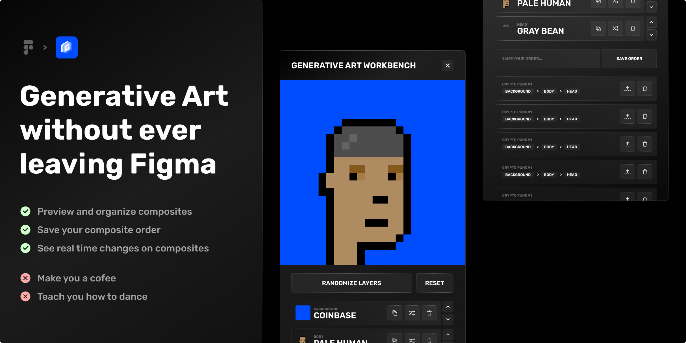

Generative Art Workbench is a helpful Figma plugin that simplifies the [process of testing and previewing](#how-to-use) different layer combinations for your generative art projects. With an [intuitive frame naming convention](#naming-convention), this plugin allows you to thoroughly experiment with various layers and efficiently generate composite previews inside Figma itself. By providing a practical solution within Figma's environment, the plugin highly streamlines your workflow and empowers you to quickly achieve the desired results in your generative/derivative style art.

# How to use

-   Install the plugin through the [community marketplace](https://www.figma.com/community/plugin/1238558860479467335);
-   Name your layers/frames according to the [naming convention](#naming-convention);
-   Organize the layer order according to your desired composite order;
-   Make changes to different layers and preview them on a real composite;

### Feature set

-   [x] View composite's preview
-   [x] Randomize and reset composite's preview
-   [x] Update current composite order by moving layers up or down in the list
-   [x] Update, Delete and Randomize specific composite layers
-   [ ] Save a composite order with a unique name
-   [x] Load or delete saved composite orders

# Naming convention

> ⚠️ For the plugin to work this is **MANDATORY**!

# Contribute
